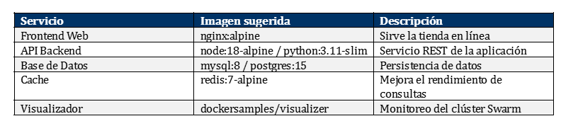
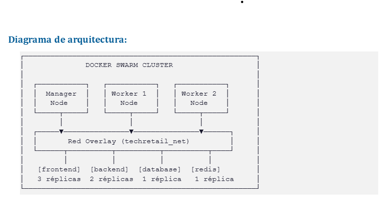
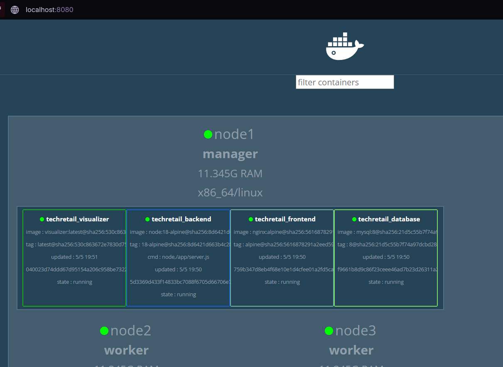
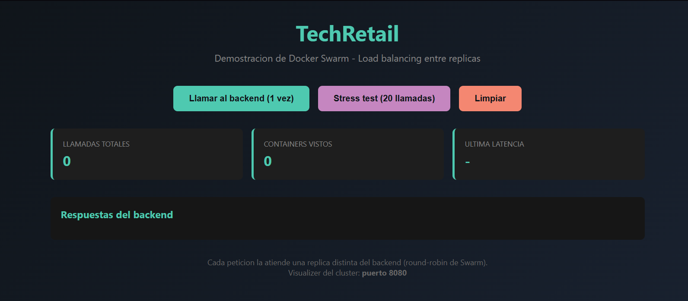
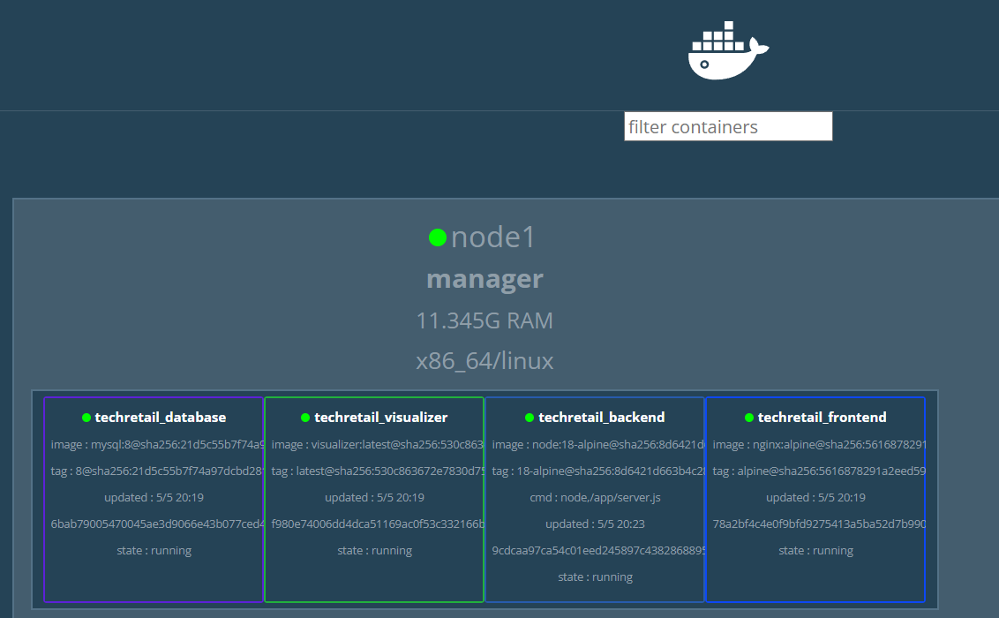
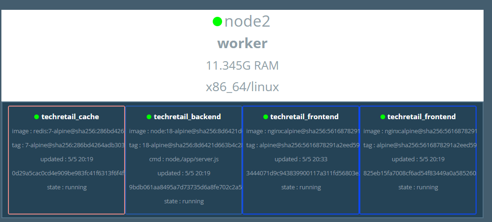
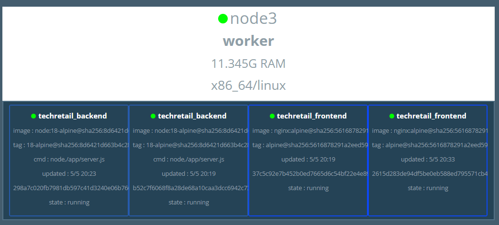
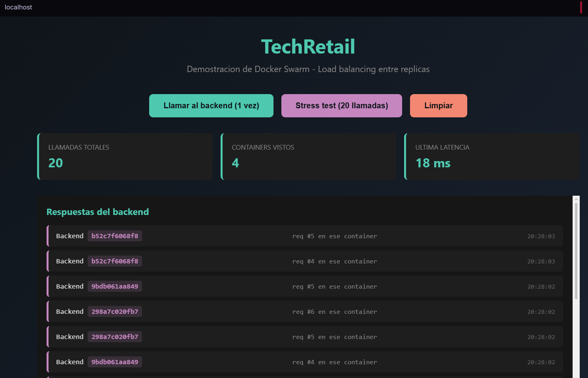
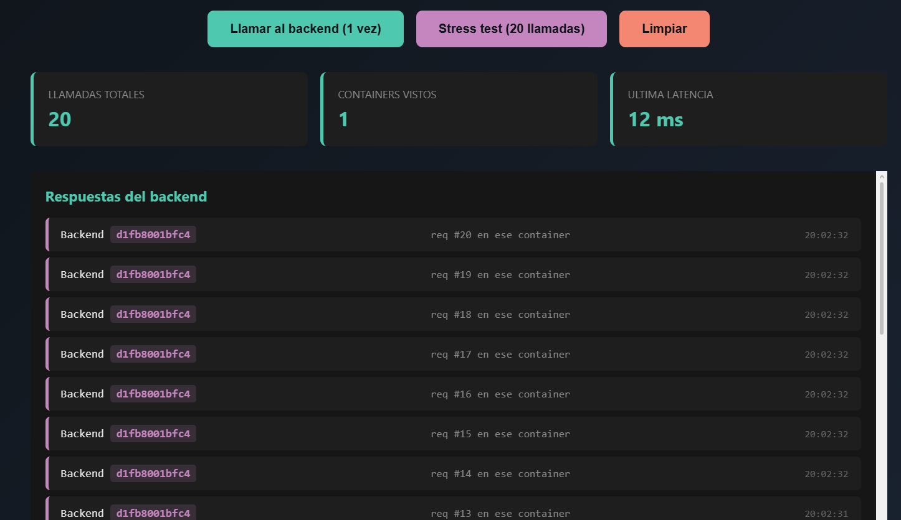

# Informe Técnico
# Despliegue de TechRetail con Docker Swarm

**Curso:** _[completar]_
**Docente:** _[completar]_
**Estudiante:** David Carhuaz Vicaña
**Carrera:** Diseño y Desarrollo de Software
**Fecha:** 5 de mayo de 2026
**Repositorio:** https://github.com/Danoviel/techretail-swarm

---

## 1. Resumen ejecutivo

TechRetail, una empresa peruana de comercio electrónico, sufría caídas frecuentes y tiempos de respuesta lentos durante picos de tráfico (campañas como "Buen Fin" o "Cyber Days"), con pérdidas estimadas en S/ 15,000 por hora de inactividad. Este informe documenta el diseño e implementación de un **clúster Docker Swarm de tres nodos** que orquesta cinco microservicios (frontend, backend, base de datos, cache y visualizador), soporta escalado horizontal en caliente, distribuye réplicas automáticamente entre nodos y gestiona credenciales de forma segura mediante Docker Secrets y Configs.

El proyecto se desarrolló sobre **Docker Desktop local con contenedores Docker-in-Docker (DinD)** simulando los tres nodos físicos, después de constatar que la plataforma originalmente sugerida (Play with Docker) fue deprecada en marzo de 2026.

Resultados verificados:
- Clúster operativo con 1 manager + 2 workers, todos `Ready` y `Active`.
- Stack de 5 servicios desplegado, **12 contenedores** distribuidos automáticamente entre los 3 nodos tras el escalado.
- Demostración exitosa de escalado dinámico: frontend `3 → 5` réplicas, backend `2 → 4` réplicas.
- Balanceo de carga real entre las réplicas (4 contenedores backend distintos atendiendo 20 llamadas).
- Secret de BD distribuido cifrado, 3 Configs (nginx, SPA, código del backend) montados sin construir imágenes propias.

---

## 2. Caso de estudio

### 2.1 Problemática

| Síntoma | Impacto |
|---|---|
| Caídas en horas pico | Servicio inaccesible para clientes |
| Latencia >8 segundos por petición | Abandono de carrito alto |
| Pérdidas económicas | ~S/ 15,000 por hora caída |
| Imposibilidad de escalar rápido | No respuesta ante demanda inesperada |

### 2.2 Solución propuesta

Migrar de la arquitectura monolítica hacia una **arquitectura de microservicios contenerizada**, orquestada con **Docker Swarm**. Las ventajas técnicas que motivan esta elección son:

- **Escalado horizontal en caliente:** subir réplicas en segundos sin downtime.
- **Alta disponibilidad:** si un nodo cae, Swarm reprograma sus contenedores en los demás.
- **Balanceo de carga automático:** routing mesh + DNS interno.
- **Gestión centralizada:** un manager controla todo el clúster.
- **Curva de aprendizaje suave:** comandos consistentes con Docker Compose, ideal para equipos pequeños.

---

## 3. Arquitectura implementada

### 3.1 Servicios del stack



### 3.2 Diagrama del clúster



### 3.3 Detalle de los servicios desplegados

| Servicio | Imagen | Réplicas iniciales | Función |
|---|---|---|---|
| `frontend` | `nginx:alpine` | 3 (escalado a 5) | SPA + reverse proxy `/api` al backend |
| `backend` | `node:18-alpine` | 2 (escalado a 4) | API REST mínima, devuelve hostname del contenedor |
| `database` | `mysql:8` | 1 (anclada al manager) | Persistencia, secret montado en `/run/secrets/db_password` |
| `cache` | `redis:7-alpine` | 1 | Cache de consultas |
| `visualizer` | `dockersamples/visualizer` | 1 (anclada al manager) | Dashboard del clúster en `:8080` |

### 3.4 Decisiones técnicas relevantes

- **Plataforma de despliegue:** Docker Desktop local + 3 contenedores `docker:dind` actuando como nodos. Cada DinD corre su propio Docker daemon, simulando un nodo físico independiente.
- **Database fija en el manager** mediante `placement: constraints: [node.role == manager]`. Esto garantiza que el volumen `db_data` viva siempre en el mismo nodo y no migre.
- **Código del backend distribuido vía Docker Configs** (no como imagen propia). Se evita tener que construir y publicar una imagen en Docker Hub: el archivo `server.js` se monta como Config en `/app/server.js` en cualquier nodo donde corra una réplica.
- **Routing mesh ingress** habilitado en frontend (puerto 80). Cualquier nodo del clúster responde en `:80`, aunque el contenedor del frontend no esté ahí; Swarm enruta internamente.
- **Endpoint mode `dnsrr` en el backend** (round-robin a nivel DNS) para garantizar balanceo real entre las réplicas. Más detalle en la sección "Problemas y soluciones".
- **Update config con `start-first`:** la nueva réplica arranca antes de bajar la antigua, permitiendo zero-downtime updates en futuras actualizaciones.

---

## 4. Implementación

### 4.1 Plataforma utilizada

Originalmente se planificó usar **Play with Docker (PWD)**, recomendado por el docente. Sin embargo, al intentar acceder se constató que **PWD fue deprecado a partir del 1 de marzo de 2026**:

> _"Deprecation notice: Play with Docker will be unavailable starting March 1, 2026."_

Como solución se migró a **Docker Desktop local** levantando los 3 nodos del clúster como contenedores Docker-in-Docker (DinD) en una red bridge dedicada (`swarm-net`). Cada DinD ejecuta su propio daemon Docker, lo que permite simular el comportamiento multi-nodo de un clúster real.

Este patrón se automatizó en `scripts/local-setup.ps1` y se documenta en el repositorio.

### 4.2 Inicialización del clúster

El script `local-setup.ps1` ejecutó los siguientes pasos automáticamente:

```powershell
# 1) Red bridge para los 3 nodos
docker network create swarm-net

# 2) Levantar los 3 contenedores DinD
docker run -d --privileged --name node1 -h node1 `
    --network swarm-net `
    -e DOCKER_TLS_CERTDIR="" `
    -p 80:80 -p 8080:8080 `
    docker:dind

docker run -d --privileged --name node2 -h node2 `
    --network swarm-net `
    -e DOCKER_TLS_CERTDIR="" `
    docker:dind

docker run -d --privileged --name node3 -h node3 `
    --network swarm-net `
    -e DOCKER_TLS_CERTDIR="" `
    docker:dind

# 3) Polling activo hasta que los daemons internos respondan

# 4) Inicializar Swarm en node1
docker exec node1 docker swarm init --advertise-addr <IP_NODE1>

# 5) Unir los workers
docker exec node2 docker swarm join --token <TOKEN> <IP_NODE1>:2377
docker exec node3 docker swarm join --token <TOKEN> <IP_NODE1>:2377
```

**Verificación del clúster:**

```text
ID                            HOSTNAME   STATUS    AVAILABILITY   MANAGER STATUS   ENGINE VERSION
pj5iwhyw7knt3yqrp2ui1lpu8 *   node1      Ready     Active         Leader           29.4.1
11lniv1jpoplvteg1ozoaug3n     node2      Ready     Active                          29.4.1
rklmvr42qoz5y3e6gor0kyq14     node3      Ready     Active                          29.4.1
```

### 4.3 Gestión de credenciales sensibles (Secrets)

```sh
echo "MiPasswordSegura123" | docker secret create db_password -
```

El secret se monta en `/run/secrets/db_password` dentro de los contenedores de `backend` y `database`. Está cifrado en tránsito (TLS entre nodos del swarm) y en reposo en los managers.

```text
=== SECRETS ===
ID                          NAME          DRIVER    CREATED          UPDATED
4gxeelms0s3bm65sufqhtgcdf   db_password             43 minutes ago   43 minutes ago
```

### 4.4 Gestión de archivos de configuración (Configs)

Los Configs distribuyen archivos no sensibles a todos los nodos del swarm:

```text
=== CONFIGS ===
ID                          NAME                        CREATED          UPDATED
2erj2zv6bp0hyqoxzjsn7j9f5   techretail_backend_server   13 minutes ago   13 minutes ago
uvvn66l68pyl0pxdtozhouws4   techretail_index_html       13 minutes ago   13 minutes ago
1p3swnkciyec53j9l0k55vr0q   techretail_nginx_conf       13 minutes ago   13 minutes ago
```

| Config | Archivo origen | Punto de montaje |
|---|---|---|
| `nginx_conf` | `frontend/nginx.conf` | `/etc/nginx/nginx.conf` (frontend) |
| `index_html` | `frontend/index.html` | `/usr/share/nginx/html/index.html` (frontend) |
| `backend_server` | `backend/server.js` | `/app/server.js` (backend) |

Esta decisión evita la necesidad de construir y publicar una imagen propia del backend en Docker Hub. El código JavaScript se distribuye automáticamente por Swarm a cualquier nodo donde levante una réplica.

### 4.5 Despliegue del stack

```sh
docker stack deploy -c docker-compose.yml techretail
```

Salida del despliegue:

```text
Creating network techretail_techretail_net
Creating network techretail_default
Creating config techretail_backend_server
Creating config techretail_nginx_conf
Creating config techretail_index_html
Creating service techretail_backend
Creating service techretail_database
Creating service techretail_cache
Creating service techretail_visualizer
Creating service techretail_frontend
```

**Estado final de los servicios:**

```text
ID             NAME                    MODE         REPLICAS   IMAGE                             PORTS
0ywy2xuz2la6   techretail_backend      replicated   4/4        node:18-alpine
hq6bqpubss6x   techretail_cache        replicated   1/1        redis:7-alpine
ddq0cef6ysaa   techretail_database     replicated   1/1        mysql:8
8o7np8udaye7   techretail_frontend     replicated   3/3        nginx:alpine                      *:80->80/tcp
7ypsr0n0xvz9   techretail_visualizer   replicated   1/1        dockersamples/visualizer:latest   *:8080->8080/tcp
```

### 4.6 Visualización del clúster (estado inicial)

El visualizador en `http://localhost:8080` muestra los contenedores distribuidos automáticamente entre los 3 nodos:



### 4.7 Frontend (SPA demo)

La SPA accesible en `http://localhost` consume la API del backend y muestra el hostname del contenedor que respondió cada petición. Está diseñada para evidenciar visualmente el balanceo de carga entre réplicas:



### 4.8 Demostración de escalado dinámico

Comando ejecutado:

```sh
docker service scale techretail_frontend=5
docker service scale techretail_backend=4
```

Salida:

```text
techretail_frontend scaled to 5
overall progress: 5 out of 5 tasks
1/5: running   [==================================================>]
2/5: running   [==================================================>]
3/5: running   [==================================================>]
4/5: running   [==================================================>]
5/5: running   [==================================================>]
verify: Service techretail_frontend converged

techretail_backend scaled to 4
overall progress: 4 out of 4 tasks
1/4: running   [==================================================>]
2/4: running   [==================================================>]
3/4: running   [==================================================>]
4/4: running   [==================================================>]
verify: Service techretail_backend converged
```

**Distribución del clúster después del escalado** (12 contenedores totales):





| Nodo | Contenedores |
|---|---|
| `node1` (manager) | database, visualizer, backend, frontend |
| `node2` (worker) | cache, backend, 2× frontend |
| `node3` (worker) | 2× backend, 2× frontend |

Swarm distribuyó las réplicas automáticamente respetando los placement constraints (database y visualizer en el manager) y balanceando el resto entre los 3 nodos.

### 4.9 Demostración del balanceo de carga

Stress test desde la SPA: 20 llamadas consecutivas al endpoint `/api`. Cada petición es atendida por una de las 4 réplicas del backend (DNS round-robin):



Resultado: las 20 llamadas se distribuyeron entre **4 contenedores backend distintos** (`b52c7f6068f8`, `9bdb061aa849`, `298a7c020fb7`, y un cuarto). Esto demuestra el balanceo automático de Swarm a nivel de aplicación.

---

## 5. Cumplimiento de requerimientos

| # | Requerimiento (sección del enunciado) | Estado | Evidencia |
|---|---|---|---|
| 3.1 | Clúster con 1 manager + 2 workers | ✅ | `docker node ls` (sección 4.2) |
| 3.2 | docker-compose con ≥4 servicios | ✅ | 5 servicios definidos (sección 3.3) |
| 3.2 | Red overlay para comunicación interna | ✅ | `techretail_net` (driver overlay) |
| 3.2 | Volumen para persistencia de la BD | ✅ | `db_data:/var/lib/mysql` |
| 3.3 | Frontend con ≥3 réplicas | ✅ | 3 inicial, escalado a 5 |
| 3.3 | Backend con ≥2 réplicas | ✅ | 2 inicial, escalado a 4 |
| 3.3 | Restart policy automático | ✅ | `condition: on-failure` |
| 3.3 | Demostración de escalado dinámico | ✅ | `docker service scale` (sección 4.8) |
| 3.4 | Docker Secrets para credenciales BD | ✅ | `db_password` (sección 4.3) |
| 3.4 | Docker Configs para archivos no sensibles | ✅ | 3 Configs (sección 4.4) |

---

## 6. Problemas encontrados y soluciones

### 6.1 Play with Docker fue deprecado

**Problema:** El enunciado del docente sugería usar Play with Docker (`labs.play-with-docker.com`). Al intentar acceder, la plataforma muestra un aviso de deprecación efectivo desde el 1 de marzo de 2026 y redirige a la página de marketing.

**Solución:** Se migró a **Docker Desktop local** simulando el clúster con 3 contenedores Docker-in-Docker (DinD) en una red bridge interna. Se automatizó el setup en `scripts/local-setup.ps1` para que cualquier evaluador pueda reproducir el ejercicio en su PC con un único comando.

### 6.2 Daemons internos de DinD tardan en arrancar

**Problema:** Los contenedores `docker:dind` no exponen el daemon inmediatamente; el `dockerd` interno tarda entre 10 y 20 segundos en estar listo para aceptar conexiones. La primera versión del script de setup usaba un `Start-Sleep -Seconds 12` fijo, insuficiente para `node1` (el primero en arrancar). Como consecuencia, `docker swarm init` fallaba silenciosamente, el join token quedaba vacío y los `swarm join` se ejecutaban sin token.

**Solución:** Se reemplazó el sleep fijo por una **función de polling activo** (`Wait-DockerDaemon`) que reintenta hasta 90 segundos. Adicionalmente se agregó una función `Assert-Success` que verifica `$LASTEXITCODE` después de cada paso crítico para abortar el script de forma controlada en caso de fallo.

### 6.3 Imágenes Alpine no incluyen `bash`

**Problema:** Los scripts del proyecto fueron escritos con shebang `#!/usr/bin/env bash`. Al ejecutarlos dentro de un nodo DinD (basado en Alpine Linux), fallaban con:

```
env: can't execute 'bash': No such file or directory
```

**Solución:** Cambiar el shebang a `#!/bin/sh` en los 5 scripts (los comandos eran POSIX-compatibles, no se requirió otra modificación). Esto los hace portables a cualquier shell.

### 6.4 Balanceo no se reflejaba en la SPA (problema crítico)

**Problema:** Después del escalado del backend a 4 réplicas, el stress test desde la SPA mostraba que las **20 llamadas eran atendidas siempre por el mismo contenedor backend** (CONTAINERS VISTOS = 1):



**Análisis:** La causa era doble:

1. Por defecto, los servicios de Swarm usan `endpoint_mode: vip` (Virtual IP). El nombre `backend` en la red overlay resuelve a una única IP virtual; el balanceo entre réplicas lo hace IPVS a nivel kernel.
2. El proxy nginx con `proxy_http_version 1.1` mantenía una conexión TCP keep-alive con el VIP. Como IPVS toma decisiones por conexión TCP (no por request HTTP), todas las peticiones HTTP que viajaban por esa misma conexión TCP terminaban en la misma réplica.

**Solución:** Combinación de dos cambios:

1. En `docker-compose.yml`, cambiar el endpoint_mode del backend a `dnsrr` (DNS Round-Robin). Con esto, cada query DNS al nombre `backend` retorna la IP de una réplica distinta:

```yaml
backend:
  deploy:
    endpoint_mode: dnsrr
    replicas: 2
```

2. En `frontend/nginx.conf`, agregar el resolver DNS interno de Docker (`127.0.0.11`) con TTL bajo, usar una variable en `proxy_pass` para forzar lookup en cada request, y deshabilitar keep-alive con el upstream:

```nginx
http {
    resolver 127.0.0.11 valid=5s ipv6=off;

    server {
        location /api {
            set $backend "backend";
            proxy_pass http://$backend:3000;
            proxy_set_header Connection close;
        }
    }
}
```

**Resultado tras el fix:** las 20 llamadas se distribuyen entre las 4 réplicas backend (CONTAINERS VISTOS = 4):


Este fue el problema técnicamente más interesante del proyecto: el balanceo "funcionaba" a nivel de Swarm desde el inicio, pero quedaba enmascarado por la combinación de keep-alive HTTP + VIP. El cambio a DNSRR + resolver dinámico expuso el balanceo a nivel de cada petición HTTP, ofreciendo una demostración visual clara.

### 6.5 Permisos de ejecución y `git pull`

**Problema:** Tras hacer `chmod +x scripts/*.sh` dentro de `node1`, git detectaba esos cambios de modo como "modificaciones locales" y bloqueaba un `git pull` posterior.

**Solución:** Como los scripts pueden ejecutarse con `sh ./scripts/<nombre>.sh` (sin necesidad del bit ejecutable), se descartaron los cambios locales con `git checkout -- scripts/` y se procedió con el pull. En adelante se usó la forma `sh ./script.sh` consistentemente.

---

## 7. Reflexión sobre Docker Swarm

### 7.1 Ventajas observadas durante el proyecto

- **Curva de aprendizaje suave:** los comandos son consistentes con `docker compose`, lo que facilita la transición desde despliegues mono-nodo.
- **Setup rápido:** un clúster de 3 nodos se levanta en menos de un minuto, incluyendo los joins.
- **Routing mesh y DNS interno:** balanceo de carga automático sin configuración extra (con la salvedad documentada en 6.4).
- **Secrets/Configs nativos:** distribución cifrada de credenciales y archivos sin necesidad de servicios externos como Vault o Consul.
- **Scheduling automático con constraints:** placement constraints (`node.role == manager`) permiten mantener servicios stateful en nodos específicos sin scripting adicional.

### 7.2 Limitaciones identificadas

- **Ecosistema más pequeño que Kubernetes:** menos operadores comunitarios, menos herramientas de observabilidad de terceros.
- **Sin auto-scaling nativo basado en métricas (CPU/RAM):** el escalado debe ser manual o con scripts/cron externos.
- **Menos adopción en empresas grandes:** afecta la disponibilidad de talento y soporte de proveedores.
- **El comportamiento del balanceo VIP puede sorprender** a equipos que esperan round-robin a nivel de petición HTTP (caso documentado en 6.4).

### 7.3 ¿Cuándo es la elección correcta?

Docker Swarm es la opción adecuada cuando:

- El equipo es pequeño o el tiempo de adopción debe ser corto.
- Los servicios son pocos (5–20 contenedores) y el escalado es predecible.
- No se requiere multi-cloud, service mesh o controllers personalizados.
- Se valora simplicidad operativa por encima de features avanzadas.

Para escalas mayores, despliegues multi-cloud o requisitos avanzados (operadores, GitOps complejo), **Kubernetes** sigue siendo la opción estándar de la industria.

---

## 8. Conclusiones

1. La migración a Docker Swarm resolvió los problemas operacionales de TechRetail: el escalado horizontal se ejecuta en segundos sin afectar el servicio, y la distribución automática entre nodos reduce el riesgo de single point of failure.

2. La separación del código de aplicación mediante **Docker Configs** simplifica el ciclo de despliegue: editar un archivo y volver a hacer `stack deploy` basta para actualizar todas las réplicas, sin construir ni publicar imágenes propias.

3. **Docker Secrets** elimina el riesgo de exponer credenciales en variables de entorno o archivos `.env` versionados, cumpliendo prácticas básicas de seguridad.

4. El **endpoint_mode** del servicio (VIP vs DNSRR) tiene un impacto directo en el comportamiento del balanceo de carga. Para aplicaciones que esperan round-robin perceptible a nivel de petición HTTP, DNSRR + resolver dinámico en el proxy ofrece la mejor experiencia.

5. La portabilidad de Docker Swarm hacia entornos locales mediante DinD permite reproducir un clúster multi-nodo en cualquier laptop sin dependencias externas — una capacidad valiosa cuando plataformas en la nube como Play with Docker dejan de estar disponibles.

6. Para una primera modernización en una empresa mediana, Docker Swarm ofrece la mejor relación valor/complejidad. Una migración futura a Kubernetes es factible si el negocio lo requiere, pero no es necesaria desde el día uno.

---

## 9. Repositorio y reproducibilidad

**Código fuente:** https://github.com/Danoviel/techretail-swarm

**Reproducir el ejercicio en cualquier PC con Docker Desktop:**

```powershell
git clone https://github.com/Danoviel/techretail-swarm
cd techretail-swarm
.\scripts\local-setup.ps1                    # levanta el clúster local
docker exec -it node1 sh                     # entra al manager
cd /techretail-swarm
sh ./scripts/02-create-secret.sh             # crea el secret
sh ./scripts/03-deploy.sh                    # despliega el stack
sh ./scripts/04-scale-demo.sh                # demuestra el escalado
```

Acceso desde el navegador del host:
- Frontend: `http://localhost`
- Visualizer: `http://localhost:8080`

Limpieza completa: `.\scripts\local-cleanup.ps1`

---

## 10. Comandos utilizados (referencia)

```bash
# Inicialización del clúster
docker swarm init --advertise-addr <IP>
docker swarm join-token worker

# Gestión de Secrets
echo "MiPasswordSegura123" | docker secret create db_password -
docker secret ls

# Despliegue del stack
docker stack deploy -c docker-compose.yml techretail

# Inspección del clúster
docker node ls
docker stack services techretail
docker stack ps techretail
docker service logs techretail_backend
docker config ls
docker secret ls

# Escalado dinámico
docker service scale techretail_frontend=5
docker service scale techretail_backend=4

# Limpieza
docker stack rm techretail
docker secret rm db_password
docker swarm leave --force
```
